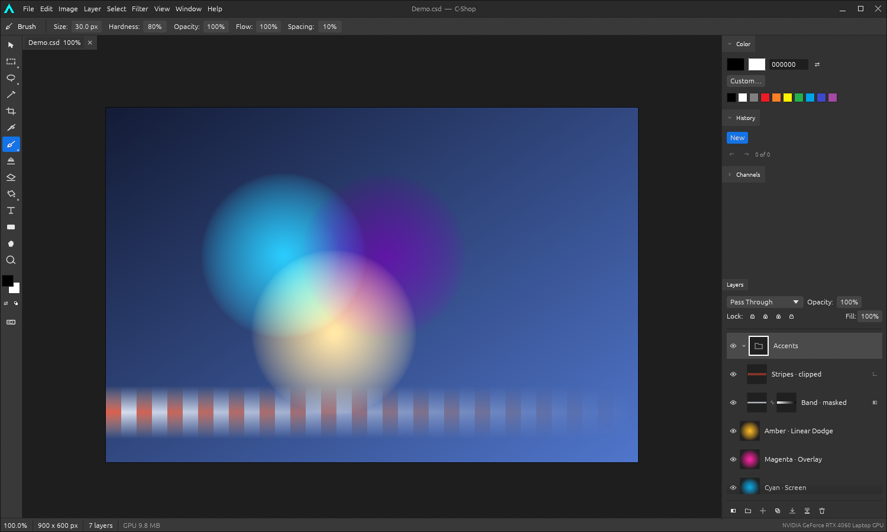
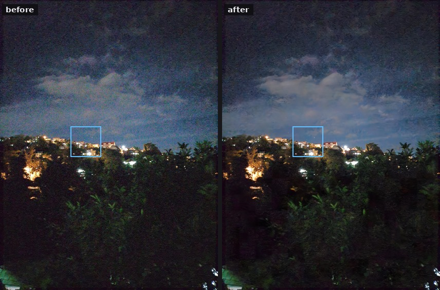
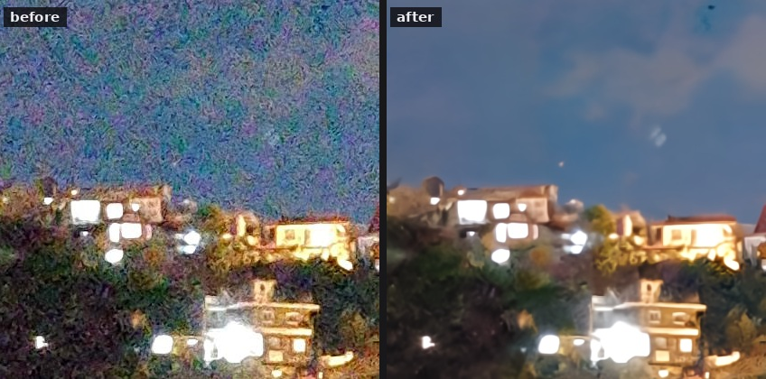
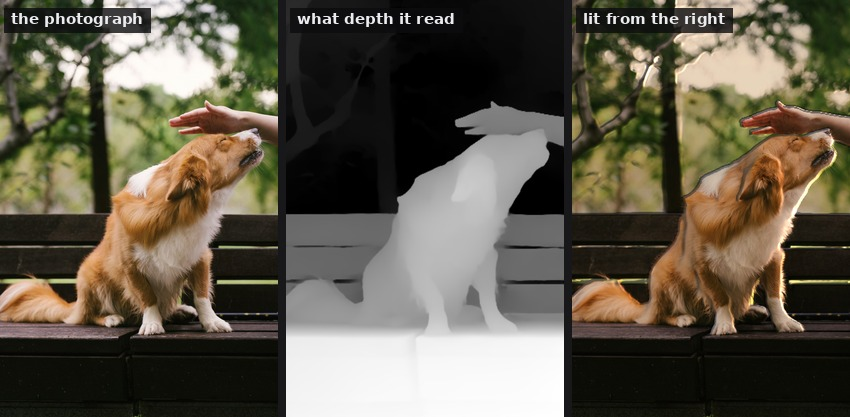
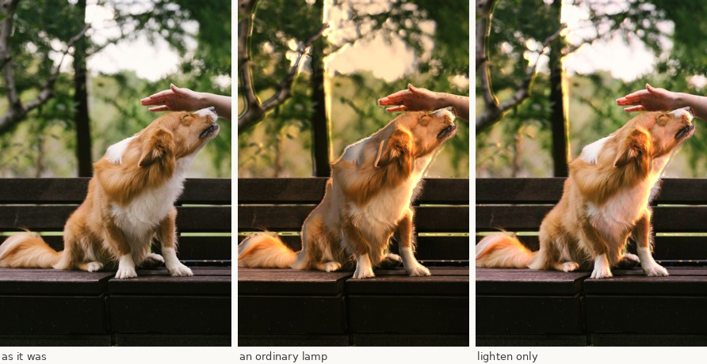
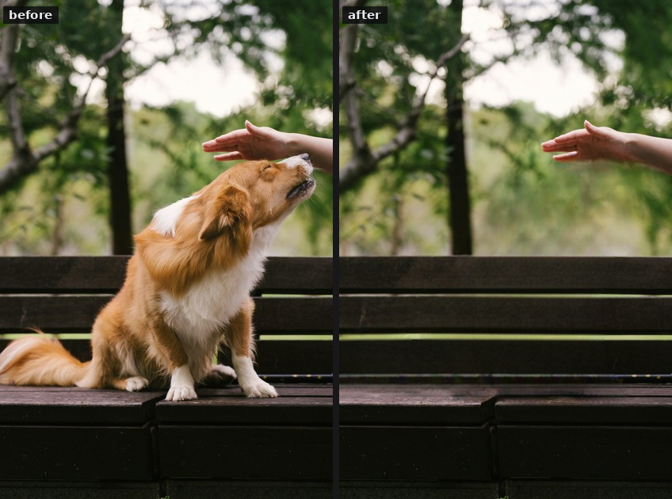
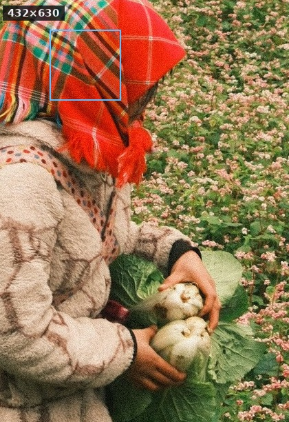
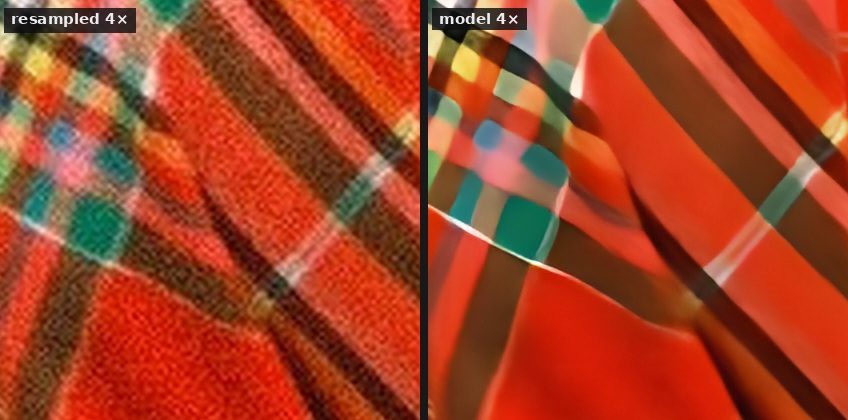

# C-Shop

**[c-shop.org](https://c-shop.org)**

A native, GPU-accelerated, layer-based image editor. No browser, no Electron,
no web view — a real desktop binary that composites on the GPU and is on screen
in about 400 ms.

It also has an **agentic harness**: the same editor drives from a script with
no window at all, so something that cannot see a canvas or click a button can
still edit images with it — placing type from measurements and reading back a
report of what it drew. It runs as an **MCP server** too, so that harness can
be reached over a network, with each result carrying a picture of what it did.
[docs/AGENTIC.md](docs/AGENTIC.md) is that half of it.

An optional **deep-learning pack** adds seven neural networks to that: one that
finds objects and names them, one that turns a point or a box into a mask, one
that labels every pixel with what it is, one that fills a hole in with what was
behind it, one that guesses how far away everything is, one that takes the
noise out of a photograph and one that enlarges it. So "cut the
dog out of this picture" and "clean up this sky" become things the editor can
be asked for rather than things someone has to do by hand. They run in a process of their
own, so the editor keeps its single-binary, no-dependency build whether they
are installed or not.



## Status

A personal tool, in active development. It is built for its author's own work,
so it changes whenever a bug turns up or a feature is wanted, and those changes
are pushed as they happen rather than gathered into releases. The versions in
[CHANGELOG.md](CHANGELOG.md) are a count of those pushes rather than a promise
about any of them — expect no stability guarantees. The project format is the
exception: it carries a version and skips chunks it does not recognise, so
files already saved keep opening.

## Why

Most capable image editors are either enormous proprietary suites or web apps
wearing a desktop costume. C-Shop is neither: a single Rust binary, a Vulkan
compositor, and an interface that behaves the way people who edit images
already expect — layers, masks, blend modes, non-destructive adjustments, and
the keyboard shortcuts your hands already know.

It needs no system packages beyond a working GPU driver. X11 is opened through
`dlopen`, Vulkan through `ash`, and every remaining dependency is pure Rust, so
`cargo run --release` is the whole install.

## What it does

One line each; [docs/FEATURES.md](docs/FEATURES.md) has the same list with the
reasoning left in, and a picture where there is one to show.
[c-shop.org](https://c-shop.org) is the shorter version again, with the
pictures larger.

**Layers and what hangs off them**

- [**Layers**](docs/FEATURES.md#layers) — raster, group, fill, type, shape and
  adjustment layers, with 27 blend modes evaluated on the GPU.
- [**Masks and channels**](docs/FEATURES.md#masks-and-channels) — layer and
  clipping masks, Quick Mask, saved channels; masks, layers and selections all
  convert into each other.
- [**Layer effects**](docs/FEATURES.md#layer-effects) — eleven of them, every
  one a function of how far a pixel sits from the layer's edge.
- [**Layer states**](docs/FEATURES.md#layer-states) — two versions of a design
  in one document, remembering settings rather than pixels.
- [**Smart objects**](docs/FEATURES.md#smart-objects-and-linked-copies-of-one)
  — the placement is a setting, and several layers can place one picture so
  correcting it is one correction.
- [**Smart filters**](docs/FEATURES.md#smart-filters) — a stack of filters
  attached to a layer instead of run into it.
- [**Vector masks**](docs/FEATURES.md#vector-masks) — a mask that keeps the
  path it was drawn from, so resizing redraws it rather than resampling it.

**Choosing what to work on**

- [**Selecting**](docs/FEATURES.md#selecting) — marquees, lassos and a wand,
  plus colour range, refine edge against the photograph's own boundary, and
  paths both ways.
- [**Guides, rulers and
  snapping**](docs/FEATURES.md#guides-rulers-and-snapping) — saved with the
  document, catching by whichever edge is closest.

**Putting paint down**

- [**Painting**](docs/FEATURES.md#painting) — brush, pencil, eraser, clone
  stamp, dodge, burn, sponge, blur, sharpen and smudge on one stroke engine,
  with tablet pressure and brushes made from a selection.
- [**Repairing**](docs/FEATURES.md#repairing) — a healing brush and its spot
  form, taking texture from elsewhere and tone from where they land; a history
  brush.

**Drawing rather than painting**

- [**Type**](docs/FEATURES.md#type) — re-editable text from your installed
  fonts, edited live on canvas, a typing session per undo step.
- [**Shapes**](docs/FEATURES.md#shapes) — six kinds drawn from distance
  fields, with Bézier paths, a Pen tool and boolean operations.
- [**Vector files**](docs/FEATURES.md#vector-files) — SVG in and out as
  editable geometry; PDF out as a page.

**Changing the picture**

- [**Adjustments**](docs/FEATURES.md#adjustments) — fourteen, each available
  destructively and as a non-destructive layer, with a curve editor and a live
  histogram.
- [**Filters**](docs/FEATURES.md#filters) — thirty, each previewing live at
  1:1 rather than on a proxy.
- [**Transforms**](docs/FEATURES.md#transforms) — Free Transform through to
  perspective distort, crop, image size, canvas size.
- [**Warping, carving and
  straightening**](docs/FEATURES.md#geometry-warping-carving-and-straightening)
  — warp and puppet warp, content-aware scale, perspective crop.
- [**Lens correction**](docs/FEATURES.md#lens-correction) — distortion,
  keystone, angle and vignette composed into one resampling pass.

**What the models make possible** ([optional pack](docs/VISION.md))

- [**Depth**](docs/FEATURES.md#depth) — haze, a shallow depth of field and a
  shift of viewpoint, from one depth map; and relighting, which now has a
  lighten-only mode that never takes light away.
- [**A different sky, and retouched
  skin**](docs/FEATURES.md#replacing-a-sky-and-retouching-skin) — both mostly
  judgement rather than machinery, and the judgement is written down.
- [**Aligning frames**](docs/FEATURES.md#aligning-frames) — corners that
  appear in both, matched and fitted; stack the result and the noise averages
  away.

**Files and colour**

- [**Colour**](docs/FEATURES.md#colour) — ICC profiles, CMYK as four inks,
  sixteen bits a channel, and a colour-managed canvas with soft proofing.
- [**Raw files**](docs/FEATURES.md#raw-files) — DNG and the formats DNG-shaped
  enough to carry the same tags, developed to sixteen bits.
- [**Animation**](docs/FEATURES.md#animation) — a GIF or APNG as a layer per
  frame with a timeline, written back out whole.
- [**Files**](docs/FEATURES.md#files) — a layered `.cshop` project, PSD both
  ways, and eight flat formats.
- [**Clipboard**](docs/FEATURES.md#clipboard) — copy, cut, copy merged and
  paste in place, to and from other programs.

**The program itself**

- [**It remembers**](docs/FEATURES.md#it-remembers) — window, tool, brush,
  colours, panels, view and the last dozen files.
- [**Nothing waits on a frozen
  window**](docs/FEATURES.md#nothing-waits-on-a-frozen-window) — anything slow
  runs on a worker with a progress bar and a way to stop it.

## Build and run

Rust 1.85 or newer, and a GPU driver with a Vulkan, Metal or DX12 backend.

```sh
git clone https://github.com/stubbb/c-shop.git
cd c-shop
cargo run --release
```

Open files straight from the command line:

```sh
cargo run --release -- photo.jpg
```

Render a frame offscreen without a window, which is how the interface is
checked in CI:

```sh
cargo run --release -- --screenshot out.png --demo --size 1500x900
```

`--help` lists the rest. [docs/SHORTCUTS.md](docs/SHORTCUTS.md) is the full
keyboard reference.

To put it in the desktop's application menu, with an icon and the file types it
opens:

```sh
./packaging/install-desktop.sh          # --no-desktop to skip the desktop icon
./packaging/install-desktop.sh --uninstall
```

Everything it writes goes under `~/.local/share`, so it needs no root. It also
registers the `.cshop` format — matched by the file's own magic rather than its
extension — so a project file gets an icon and something to open it with.

The optional models are a separate install and the editor does not depend on
them either way:

```sh
vision/setup.sh
```

**Without a window at all** — driven by a script, served over MCP, or run in a
container on a machine with no GPU: [docs/AGENTIC.md](docs/AGENTIC.md).

## Best features

The six that are hardest to get any other way. Everything else is in
[docs/FEATURES.md](docs/FEATURES.md).

### Recognising, cutting out and cleaning up

Two of the seven models in the optional pack: one that finds objects and says
where they are, and one that turns a point or a box into a mask. Together they
take a photograph to a cut-out without anyone having to say where
anything is. This is the whole of it:

```
open dog.jpg
resize fit=1000               # the models see plenty at this size, and it is quicker
detect                        # → dog 90% at 4,303 632x501; bench 56%
segment class=dog feather=1   # the dog becomes the selection
layer via-copy                # lift it onto its own layer
layer select 0
layer delete                  # drop the background
export dog.png                # PNG keeps the transparency
```

| | | |
|---|---|---|
|  |  |  |
| the photograph | what `detect` found | what `segment` cut out |

The middle picture is drawn by C-Shop from the detector's own answer — the
boxes and labels are `shape` and `text` commands — so the whole illustration is
the editor describing its own work.

**Select ▸ Segment Object…** does the same by hand: click the thing you want and
it becomes the selection, click again to refine, Alt-click to exclude, and a
slider softens the edge. `segment` leaves an ordinary selection either way, so
everything the editor already does with one applies.

### Removing noise

The third model is SCUNet — Swin transformer blocks inside a UNet — reached
from **Filter ▸ Remove Noise…** or from `denoise`. A phone photograph of a
hillside at night, twelve megapixels, taken at the sort of ISO that turns a sky
into confetti:

```
open noise1.jpg
denoise     # → removed noise: 252 tiles, moved 7.5 levels a channel
```



Even shrunk to fit here the sky is a different thing on the right, and the
clouds the noise was hiding come back. The blue square marks the part below, at
one pixel to one pixel:



The magenta-and-green confetti is gone and the houses are still houses —
window frames, roof lines, the railing along the terrace, the individual street
lights. Measured as high-frequency energy, the sky lost 92% of what it had and
the town only 79%, which is the difference between noise and detail showing up
as a number.

It is honest about what it costs. That frame took **7 minutes 40 seconds**; the
window said "about 8 minutes" before starting, from a rate measured on quite
different pictures, so the warning is worth believing. Most of any photograph
does not need this, so select the part that does and it is seconds instead. And because the model runs *once*,
with **strength** mixing its answer back afterwards, the question of how much
of it you want is settled against the finished picture rather than guessed at
beforehand.

The trade is real and worth knowing: what removes sensor noise also softens
fine texture that resembles it. Deep foliage goes slightly painterly here. That
is what `strength` is for.

### Lighting a photograph again

**Layer ▸ Relight…**, or `relight`, reads how far away everything is, turns
that into which way each surface faces, and lights it from somewhere else:



The lamp is a dot on a circle rather than two numbers, and the window says
"from the top right" so nobody has to think in degrees. The depth takes a third
of a second and does not change while the lamp moves, so it is worked out once
and dragging the light after that is arithmetic.

A depth model does not draw a slope at the edge of an object, it draws a step:
the dog is here and the trees are four metres behind him, with nothing in
between. There is no surface there, so it is not lit — which is why the light
in the picture below stops at the dog's outline rather than glowing off it into
the air. Smoothing the shape first, to take the model's noise off it, is done
within a surface and never across one, for the same reason.

The contrast in a relight comes from dropping **ambient** — what survives where
the lamp does not reach — and dropping ambient is also how a photograph quietly
loses the shadow detail it was carrying. **Lighten only** takes that trade
away: no pixel comes out darker than it went in, so the lamp adds where it
reaches and does nothing where it does not.



A low warm lamp from the right, which is the side the photograph was already
lit from — so it reads as late afternoon rather than as a second sun:

```
relight azimuth=180 elevation=10 intensity=3.0 ambient=0.55 relief=4.0 color=#ffb35c
```

Same lamp in both. The rim on the dog's back and the light through the hand
are identical; what differs is everything the lamp does *not* reach. In the
middle 83% of the frame came out darker than it started — the trees on the
left lose their separation and the bench in front goes to black. On the right
not one pixel is darker. Under the flag ambient stops being a darkener and
becomes a *threshold*: the lamp has to beat `1 - ambient` before it shows, so
the light lands only on what most faces it and the rest of the photograph is
left exactly as it was.

It is not physical relighting: no cast shadows, no idea how shiny anything is,
and the new lamp is added to whatever already lit the picture. On a subject it
is convincing; on a scene whose lighting is the point it will look like what it
is.

The same depth answers a second question — *which part of this is near* — which
in a layered editor is a mask. `depth mask`, or **Layer ▸ Layer Mask ▸ From
Depth**, puts it straight on: near reveals, far hides, and an adjustment
clipped to it lands on the subject without anyone selecting anything.

### Making something disappear

Three of them compose into the thing people actually want:

```
open dog.jpg
detect class=dog             # → found 1: dog 90% at 4,274 569x450
segment class=dog expand=20  # the dog becomes the selection,
                             #   with room round it
inpaint                      # → filled in 588x483 at 0,258
```



Seven seconds, and nobody had to say where anything was. The `expand=20` is the
part worth copying: a mask that hugs an object leaves the object's own edge
behind for the model to continue, and what you get is a faint outline of the
thing you removed. Give it room. Too much room is a different mistake — at 40
this one starts eating the hand.

There is no seam because nothing outside the hole is replaced — the model hands the rest back
bit for bit, and a test asserts that not one pixel outside the selection may
differ.

It continues what surrounds the hole and does nothing else: no prompt, no
diffusion, nothing that takes minutes on a processor. **Remove this**, not
**imagine that**. **Edit ▸ Fill In Selection** does the same by hand.

### Separating a picture by what is in it

**Layer ▸ Separate by Content…**, or `separate`, labels every pixel with what
it is — a hundred and fifty kinds of thing, including all the ones the detector
has never heard of — and makes one layer from each:

```
open hillside.jpg
separate    # → separated into 3 layers: sky 49%, tree 40%, mountain 11%
```

Each is an ordinary layer, named for what it is, transparent everywhere else,
stacked above the original. So the composite is unchanged and the photograph is
suddenly something a layered editor can take a piece at a time — grade the sky
without touching the hillside, clean the foliage and leave the buildings alone.
The boundaries are approximate, which is why the edge is feathered by default
and why `segment` is still the tool for a real cut-out.

### Enlarging

**Image ▸ Upscale…**, or `upscale scale=4`, grows the whole document — canvas,
layers, offsets and masks — with Real-ESRGAN putting in the detail a bigger
sensor would have recorded. Five megabytes of model, and this 432×630 frame
went to four times that in five seconds:



The blue square, at one pixel to one pixel, against the same enlargement done
by resampling:



Worth noticing what actually happened there. Both halves carry the *same*
amount of high-frequency energy — 1.01 times, which says they are equally
detailed and is useless. On the left that energy is magnified film grain and
JPEG artefacts; on the right it is the edges of the tartan. An aggregate number
cannot tell those apart and the eye does it instantly, which is the whole
argument against judging an upscaler by arithmetic: against a known original
this model also scores **worse** than Lanczos, 24.6 dB against 29.4.

It invents what it cannot know. For a picture to look at, that is exactly what
is wanted; where the pixels are evidence, `resize` only ever moves what is
already there.

The models run in a separate process, so the editor keeps its single-binary,
no-dependency, offline build whether they are installed or not.
[docs/VISION.md](docs/VISION.md) covers what they do well and where they miss.

## Interface

| | |
|---|---|
|  |  |
| Vector shape layers, Bézier paths and boolean operations | Re-editable type |
|  |  |
| Adjustments with a live histogram | Filters with a zoomable preview |
|  |  |
| Layer effects | Selections and masks |

Each of those is explained where it sits in
[docs/FEATURES.md](docs/FEATURES.md).

## How it is built

Five crates, with dependencies pointing one way:

```
cshop-app  →  cshop-ui  →  cshop-gpu  →  cshop-core
                       ↘   cshop-io   ↗
```

- **`cshop-core`** — the document model and every pixel operation, with no GPU
  and no interface. Blend modes, adjustments, filters, selections, masks,
  paint, resampling, text layout, shape rasterisation, colour profiles, undo
  history.
- **`cshop-gpu`** — the Vulkan compositor: layer textures, the ping-pong
  render passes that evaluate blend modes, and readback.
- **`cshop-io`** — image decoding and encoding, the two layered formats, and
  the colour profiles files carry.
- **`cshop-ui`** — panels, tools, dialogs, the theme, and the whole
  interaction layer.
- **`cshop-app`** — the window, the swapchain, and the offscreen capture path.

About 85,000 lines of Rust and 500 of WGSL, with a further 950 of Python in the
optional vision sidecar — the only part that is not Rust, and the only part
that runs outside the binary. [docs/ARCHITECTURE.md](docs/ARCHITECTURE.md)
explains the decisions that are not obvious from the code — the colour space,
why the compositor cannot use fixed-function blending, and how vector layers
avoid special-casing everything downstream.

## Testing

1143 tests, and the interesting ones are not unit tests:

- **GPU against CPU.** Every blend mode and adjustment is implemented twice,
  once on each, and the two are compared pixel by pixel. Worst divergence:
  0.84 of one 8-bit level for blending, 1.1 for adjustments.
- **Synthetic input through the real interface.** A headless harness drives
  `CShopApp::update` with real pointer and keyboard events, so a widget that
  covers another fails here rather than in someone's hands. Three input
  regressions had shipped before it existed.
- **Offscreen rendering.** The `--screenshot` path exercises the identical
  egui and compositor pipeline as the window, so the interface can be looked
  at in CI.
- **Round trips and damaged files.** Both layered formats are written and read
  back and compared property by property, and both are fed truncated and
  bit-flipped versions of their own output — which must be refused, never
  crash.
- **Every style, discovered rather than listed.** The style library is read off
  disk and each one applied, so a style added later is covered without anyone
  remembering to add a test for it.
- **Cost that must not follow the canvas.** Editing a 10000x10000 document
  should cost what editing a small one does, so those are timed against each
  other rather than against a stopwatch — the shape of the cost is the thing
  being tested, not the speed of the machine.
- **Colour, measured rather than asserted.** The claims in
  [docs/COLOUR.md](docs/COLOUR.md) are tests: that black through a press
  profile comes back as `#292828` and not as black, that a wide-gamut round
  trip survives at sixteen bits — and, alongside it, that the same trip *fails*
  at eight, by twenty-three levels. A test that pins down where the program is
  weak is worth as much as one that pins down where it is strong, and it is the
  one that stops the weakness being forgotten.
- **The server, over a real socket.** The MCP tests bind a port and speak HTTP
  to it, because most of what could go wrong there is in the transport and in
  the guards around it — neither of which a test that calls the handler
  directly can see. The sandbox tests plant a symlink out of the workspace and
  confirm it is refused.

```sh
cargo test --workspace
cargo clippy --workspace --all-targets
```

## Progress

Every commit is a version, starting at 0.001 and incrementing by one.
[CHANGELOG.md](CHANGELOG.md) lists all of them with a line each, newest first.
There are no dates in it: dates say when someone was at a keyboard, and
versions say what the program is.

**Where it is now.** 0.077 — 1143 tests, and the roadmap worked through end to
end. The last four additions were a colour-managed canvas with soft proofing,
long operations moved onto workers with progress and cancellation, smart
objects that several layers can share, and a relight that never takes light
away.

**What is being worked on.** In rough order:

- **Painting at sixteen bits.** A layer holds sixteen and a file keeps them,
  but a brush, filter, adjustment or transform turns a deep layer away and
  says which menu item converts it. The stroke's coverage mask is already
  independent of depth, so what is left is the compositing at the end of a
  stroke and the sampled sources. Half of it done is worse than none.
- **Compositing a smart-filtered layer off the drawing thread.** 144 ms for
  one modest blur on twelve megapixels, 308 ms for two, every time the layer
  is dirty. Moving it means deciding what the canvas shows meanwhile, which is
  a decision about what the program is rather than a refactor.
- **Blending an aligned panorama.** The frames align and stack as layers, so a
  seam between two exposures is still a seam.
- **Custom pattern tiles loaded from an image.** The pattern overlay draws six
  generated figures; a tile taken from a selection needs somewhere to keep it
  and a way to pick it, which is a library rather than a brush.
- **Colourising a photograph that has none.** Blocked rather than deferred:
  there is no usable exported model, and this build has no network to fetch
  one with.

**Known limits, which are not on their way out.**

Selecting a range within a text layer — type editing has a caret but no
selection. Compositing is capped at half-float's eleven bits of mantissa, since
`Rgba16Unorm` would fit and wgpu does not allow it as a colour attachment, so a
document that is one deep layer skips the compositor on the way out and one
with a stack on top of it does not. PSD carries layers as raster: type and
shapes are flattened on the way out, and a 16-bit or CMYK PSD is refused rather
than misread — that last one is about the PSD reader alone, since CMYK and
sixteen bits are read and written happily as TIFF. The proprietary raw formats
are refused with the reason: they need a database of camera models maintained
by hand, and that database is the part of raw support that cannot be written,
only accumulated.

The toolbar is complete: every tool it shows is implemented.

[docs/ROADMAP.md](docs/ROADMAP.md) is the long version — what each absence
would cost, and why the ones that are still open are still open.

## Licence

MIT OR Apache-2.0, at your option.
