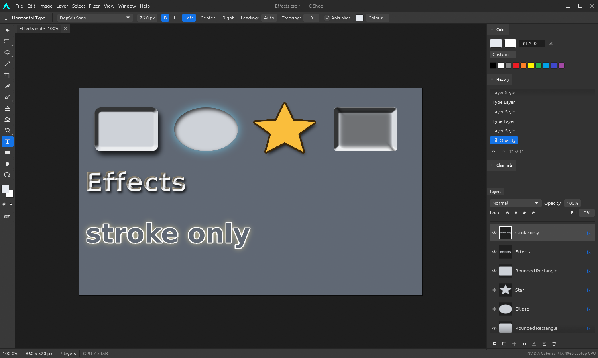
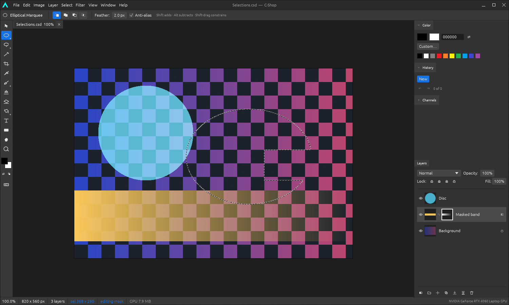
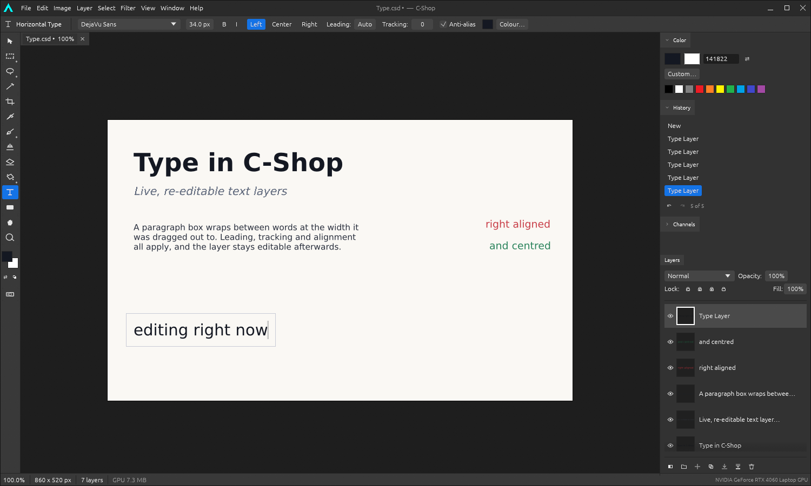
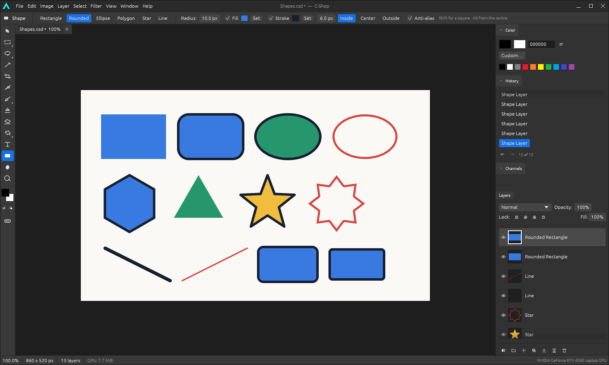
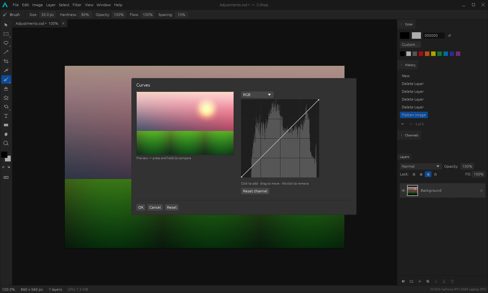
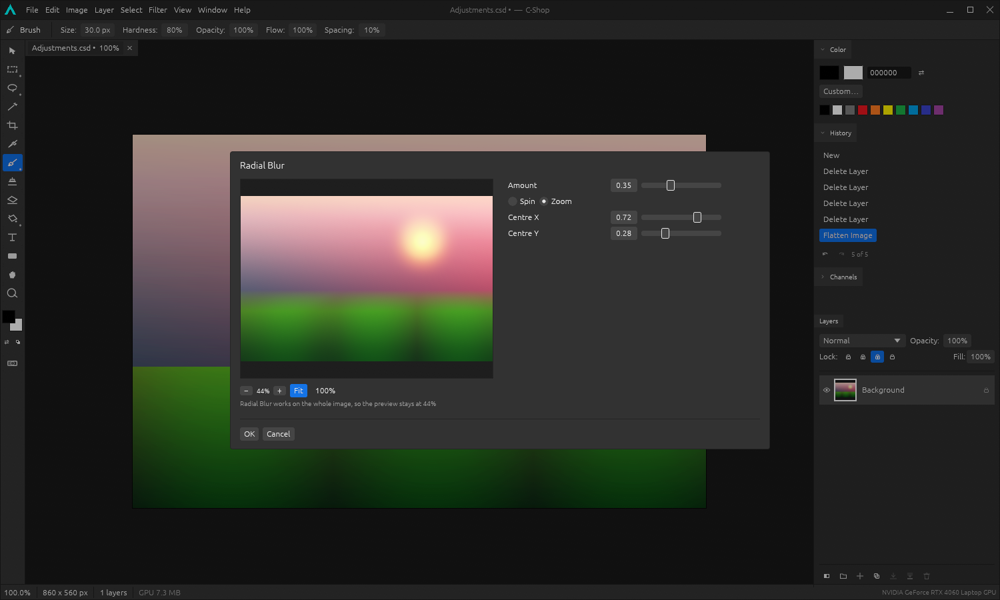

# What C-Shop does

The feature list, one section each, with the reasoning where the reasoning is
the interesting part. [The README](../README.md) is the one-line version of
this; this is the same list with the arguments left in.

Everything here is implemented and tested. What is not here is in [the
roadmap](ROADMAP.md), and what changed when is in [the
changelog](../CHANGELOG.md).

---

# Layers and what hangs off them

## Layers

Raster layers, nestable groups, fill layers, re-editable type and vector shape
layers, adjustment layers. Layer masks and clipping masks, per-layer opacity
and fill opacity, four lock modes, drag-to-reorder, and 27 blend modes (plus
Pass Through for groups) evaluated on the GPU and checked against a CPU
reference to within 0.84 of one 8-bit level.

## Masks and channels

Layer masks from a selection, from blank, or from how far away everything is;
painted on directly, enabled, applied or deleted. Masks, layers and selections
convert between each other — a greyscale layer becomes a mask on the one
below, a mask becomes a selection with its softness intact — so none of the
three is a dead end. Quick Mask. Selections saved to alpha channels in the
Channels panel.

## Layer effects

Drop shadow, outer glow, bevel and emboss (inner, outer, emboss and pillow),
inner shadow, inner glow, satin, colour overlay, gradient overlay, pattern
overlay and stroke — each with its own blend mode, opacity, colour and
geometry, and a shared global light. Every effect is a function of how far a
pixel sits from the layer's edge, so one distance field drives all of them.
Fill opacity scales the layer's own pixels and not its effects, which is what
makes a stroke-only layer possible. The Layer Style window applies as you work
and can be dragged aside, so the canvas is the preview — as can every other
window whose answer shows up there.

## Layer states

Named sets of what every layer is doing — visible or not, where, at what
opacity, in what blend mode, with which effects. Two versions of a design live
in one document, and an edit made to the picture belongs to both, because a
state remembers settings rather than pixels.

## Smart objects, and linked copies of one

A layer that keeps the picture it was made from. Scale a raster layer to a
quarter and back and you have a quarter of a picture stretched over the
original space; a smart object treats the placement as a setting rather than
an edit and re-renders from the original every time, so changing your mind
twenty times costs exactly what changing it once does — and costs the history
nothing, since a placement is nine numbers. Saved as the source and the
placement.

A smart object keeps the picture it was made from and treats the placement as
a setting, so the twentieth scaling is as good as the first. Those pictures
live in the document rather than in the layer, so several layers can place the
same one — a logo in four corners is one picture used four times, and
correcting it is one correction rather than four. The file holds it once
however many places it appears.

## Smart filters

A filter attached to a layer instead of run into it: a stack of them, each
with a switch and an opacity, with a shared mask deciding where they land. The
layer's own pixels are never touched, so "slightly less blur" is a number
rather than an undo, and taking a filter off leaves no trace of it.

## Vector masks

A mask can keep the path it was drawn from. That matters when the document is
resized: a painted mask is a picture of an edge and softens a little each time
it is resampled, while a path is a description and is simply drawn again.

---

# Choosing what to work on

## Selecting

Rectangular and elliptical marquees, freehand and polygonal lassos, magic
wand. All four boolean modes; feather, expand, contract, border, smooth,
invert, grow and similar; animated marching ants. Every tool respects the
selection, including partial coverage along a feathered edge.

Three more look harder at the picture than a marquee can. **Colour range**
finds a colour wherever it appears rather than where it is
joined to a click, and answers with partial coverage instead of a verdict, so
an edge that is halfway between comes out halfway selected. **Refine edge**
fits a boundary to the one in the photograph — a guided filter against the
image's own brightness, which is what hair needs and what growing or
feathering an edge can never do, since neither of those looks at the picture.
And a path becomes a selection or a selection becomes a path, the second by
tracing the boundary and then simplifying it, so what comes back has handles
at the corners rather than one per pixel.

## Guides, rulers and snapping

Rulers along two edges with ticks that step through round numbers as you zoom,
guides dragged out of them and dropped back to throw away, an optional grid,
and snapping that catches a layer by whichever of its edges comes closest — to
a guide, the grid, or the document's own edges and middle. The reach is fixed
in screen pixels, so a guide is equally easy to catch at any magnification.
Guides belong to the document and are saved with it.

---

# Putting paint down

## Painting

Brush, pencil, eraser and clone stamp sharing one stroke engine — size,
hardness, opacity, flow and spacing behave identically across all four.
**Dodge, burn and sponge** ride the same engine and reshape what is already
there instead of covering it: each restricted to shadows, midtones or
highlights by a falloff rather than a band, so a gradient crossing the range
does not pick up an edge. Hold Alt and dodge burns. **Blur and sharpen** are
the same again with the colour worked out from the picture underneath — read
from a copy frozen when the stroke began, so a slow stroke and a fast one over
the same path land in the same place. **Smudge** cannot work that way and does
not pretend to: it writes as it goes, carrying colour under the brush and
letting go of it as it picks up more. Paint bucket with tolerance and
contiguity; gradients in five shapes with editable stops.

Which of size and flow a pen's pressure drives is a choice, and a device that
cannot measure it presses fully, so nothing changes for a mouse. A selection's
shape becomes a brush tip, fitted to the brush size with its own proportions
kept.

## Repairing

A **healing brush** and its **spot form**, which take texture from elsewhere
and tone from where they land — the difference that lets a mark on a cheek or
a gradient come out without leaving a disc of slightly-wrong brightness
behind. The correction is fitted to the ring just outside each dab; taking it
from a blur of the middle, which is the obvious way round, quietly reproduces
part of the blemish and measures no better than plain cloning. The spot form
finds its own source by looking at what is nearby. A **history brush** paints
one region back to a marked point in the history while the rest of the
document stays where it is.

---

# Drawing rather than painting

## Type

Re-editable text layers rendered from your installed fonts, with point text
and wrapping paragraph boxes, real or synthesised bold and italic, alignment,
leading, tracking and anti-aliasing. Edited live on canvas with a caret; a
whole typing session is a single undo step.

## Shapes

Rectangles, rounded rectangles, ellipses, polygons, stars and lines, drawn
from signed distance fields so fill and stroke stay perfectly registered. Fill
and stroke are independent, the stroke sits inside, centred or outside, and
every shape stays editable after it is drawn.

## Vector files

An SVG opens as shape layers and saves back as paths, so a round trip gives
back editable geometry rather than a picture of it. Paths, rects, circles,
ellipses, lines and polygons, transforms composing through nesting, arcs
converted to cubics, and a small XML reader written for the purpose. What it
cannot draw — text, gradients, filters — it names rather than dropping. PDF
goes out as a page at the size the document would print at.

---

# Changing the picture

## Adjustments

Brightness/Contrast, Levels, Curves, Exposure, Vibrance, Hue/Saturation, Color
Balance, Black & White, Channel Mixer, Photo Filter, Invert, Posterize,
Threshold and Gradient Map — each available destructively through a dialog
with a live preview *and* as a non-destructive adjustment layer, with a
monotone curve editor and a live histogram.

## Filters

Thirty of them: Gaussian, Box, Motion, Radial, Surface and Average blur;
Sharpen and Unsharp Mask; Add Noise, Median and Dust & Scratches; Twirl,
Pinch, Spherize, Wave and Polar Coordinates; Mosaic, Crystallize and Fragment;
Clouds and Fibers; Find Edges, Emboss, Solarize and Diffuse; High Pass,
Offset, Maximum, Minimum and a 5×5 custom convolution. Each previews live,
with zoom and pan so you can judge detail at 1:1, and repeats with `Ctrl+F`.

## Transforms

Free Transform with eight handles and rotation, where Shift constrains, Alt
works from the centre and Ctrl pulls a corner into a true perspective distort.
Fixed rotations and flips, Crop with aspect presets, Image Size with four
resampling filters, Canvas Size with a nine-way anchor.

## Geometry: warping, carving and straightening

Free Transform moves four corners; **warp** and **puppet warp** bend what is
between them, one as a mesh over the layer and one as pins put where they are
wanted — the same moving-least-squares engine either way, with a rigid fit so
that what is moved keeps its shape instead of stretching to reach.
**Content-aware scale** changes a picture's proportions by carving out the
least interesting seams rather than squashing everything equally, and routes
them around whatever is selected. **Perspective crop** puts four corners on
something rectangular in a photograph and undoes the projection that made it a
quadrilateral.

## Lens correction

Distortion, perspective, angle and vignette in one window, composed into a
single resampling pass rather than four — a picture straightened, then unbent,
then de-keystoned separately comes out softer than one that had all of it done
at the same moment. The preview runs at 720p and is exact rather than
approximate, because every control is in units of the frame and none has a
size in pixels. Optional autocrop takes the largest rectangle with no
transparency in it, read off the alpha that actually resulted rather than
predicted from the settings. The full-resolution pass runs on a worker thread
behind a progress bar, so the window stays alive on a 60 megapixel frame.

---

# What the models make possible

## Depth

The depth model's answer drives three effects that are impossible without it
and ordinary with it: haze that thickens with distance, a shallow depth of
field applied to a photograph that was not taken with one, and a shift of
viewpoint. They share one depth map, because working it out is the expensive
part.

Relighting comes from the same map: a lamp placed on a circle, the shape
softened before it is lit so an object's edge shades rather than being
outlined, and a **lighten only** mode where no pixel comes out darker than it
went in. That last one matters because the contrast in a relight comes from
dropping ambient, and dropping ambient is also how a photograph loses the
shadow detail it was carrying — on a photograph of a dog on a bench, 89% of the
frame came out darker and the bench went with it. Under it, ambient becomes a
threshold instead: the lamp has to beat `1 - ambient` before it shows at all.

## Replacing a sky, and retouching skin

Both are compositions of pieces that were already here, and both turned out to
be mostly judgement rather than machinery. A replaced sky needs its horizon
found where the sky *mostly* stops, its join softened into the sky rather than
into the trees, its mask grown before it is softened, and the foreground given
some of the new sky's colour — without that last one it is a grey day with a
blue sky pasted on. Skin smoothing needs the surface blur, whose threshold is
exactly the distinction between texture and feature, and needs some of the
texture put back, because skin with no grain at all is what "retouched" looks
like from across a room.

## Aligning frames

Two photographs of the same scene differ by a movement; find enough corners
that appear in both and the movement falls out. Harris corners, oriented
binary descriptions, matching by how many bits differ, and RANSAC to throw
away the matches that agree with nothing. Align a sequence and stack it, and
the noise averages away while the picture does not — the picture is the same
in every frame and the noise is not. Frames of *different* scenes are refused
with a reason, which took explicit work: the arithmetic will happily answer
"send everything to one point" if you let it.

---

# Files and colour

## Colour

ICC profiles, read out of the containers directly rather than trusted to a
decoder, so a file that carries one keeps it. A document works in one space
and everything arriving is converted into it; assign and convert are offered
as the separate things they are. **CMYK** files open as what they are — four
inks read through the press's own profile, rather than four numbers mistaken
for a colour — and `export profile=` sends a picture back out as ink with the
profile embedded. `export depth=16` writes sixty-four bits to a pixel, keeping
precision that eight bits throws away: a gradient at thirty percent opacity
keeps 256 distinct levels against 78. **Layers hold sixteen bits** as well as
eight, so a sixteen-bit file opens deep, saves deep and exports deep — bit for
bit — and `Image ▸ Mode` moves a document between the two. See
[docs/COLOUR.md](COLOUR.md).

The canvas is colour-managed, which it has to be: showing a document's numbers
directly is right for sRGB and a lie for anything else. The colour engine runs
on the processor and the canvas is drawn on the card, so a three-dimensional
table bridges them: built once when the profiles change, read once per pixel
per frame. A document already in the screen's own space gets the identity
table and is shown exactly as it was, unchanged. Soft proofing follows from
the same machinery — document, through the press, onto the screen — which is
what shows you what the press cannot reach.

## Raw files

Files that describe themselves — DNG, and the raw formats DNG-shaped enough to
carry the same tags — open as developed sixteen-bit pictures: black
subtracted, the camera's own white balance and colour matrix applied, and the
two colours each photosite did not measure interpolated against the green
channel rather than on their own, which is what keeps colour fringes off the
edges. The proprietary formats are refused with the reason: they need a
database of camera models maintained by hand, one body at a time, and that
database is the part of raw support that cannot be written, only accumulated.

The compression is the interesting half. A DNG's sensor data is usually
lossless JPEG, which is process 14 of the same standard as ordinary JPEG and
has almost nothing else in common with it: no cosine transform, no
quantisation, and no loss. Each sample is predicted from its neighbours and
only the difference is coded — which is why a raw file is large and exact
where a photograph is small and approximate.

## Animation

An animated GIF or APNG opens as a layer per frame with a timeline over them —
and a frame *is* a layer, so painting, masks, adjustments and effects work on
one without any of them being taught what a frame is. Frames are composed on
the way in, so each is what that moment looked like rather than the small
rectangle that changed. Both formats write back out whole. Opening one used to
give back its first frame and drop the rest in silence, which is the worst way
not to support something: the file opens, looks right, and is not what was in
it.

## Files

A native layered project format, `.cshop`, that keeps the whole document — the
layer tree, groups, masks, adjustment settings, live type and shape
descriptions, effects and saved channels — still editable when reopened.
**PSD** import and export carries layers, groups, masks, opacity, blend modes,
clipping and visibility both ways, plus the flattened composite other programs
read. Flat formats: PNG, JPEG, BMP, TIFF, TGA, GIF, WebP and ICO.

## Clipboard

Copy, Cut, Copy Merged, Paste and Paste in Place, carrying a feathered
selection's soft edge with it. Images go to and come from the system
clipboard, so a copy here pastes into other programs and theirs paste in here.

---

# The program itself

## It remembers

The window opens at the size it was closed, with the tool, brush, colours,
panels and view settings it was left with, and **File ▸ Open Recent** lists
the last dozen files. Kept as JSON under the usual configuration directory,
and treated as a convenience: anything unreadable falls back to the defaults
rather than stopping the editor, and a value that would leave it unusable — a
window larger than any screen, a brush of no size — is not honoured.

## Nothing waits on a frozen window

A median on twelve megapixels is nearly four seconds, a content-aware scale
eight; held on the drawing thread each of those is a window that stops
repainting and gets offered to you for killing. Everything that slow runs on a
worker instead, with a bar in the status line saying how far along it is and a
way to stop it — one mechanism, so a filter, a resize, an alignment and a
model run all behave the same way. A filter also checks that the pixels it
read are still the ones there before writing its answer back, so a stroke made
while it ran does not quietly disappear.
