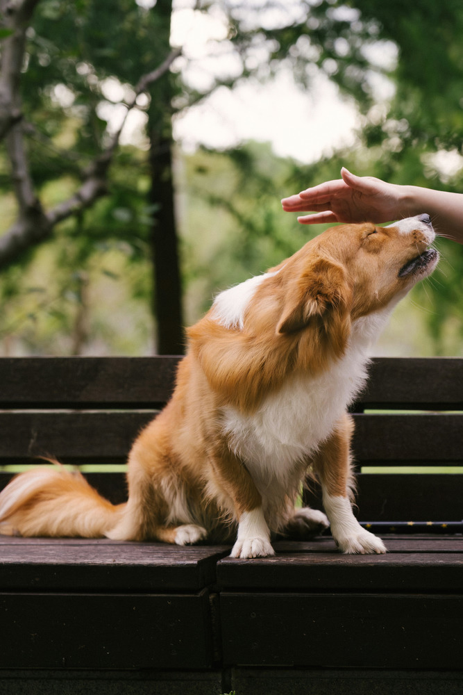
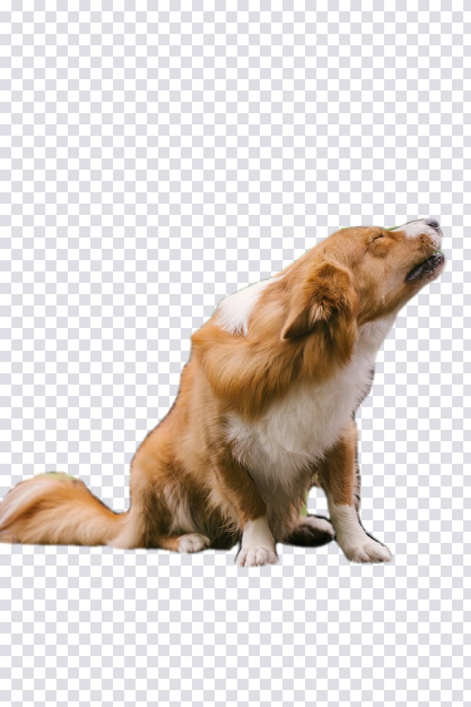
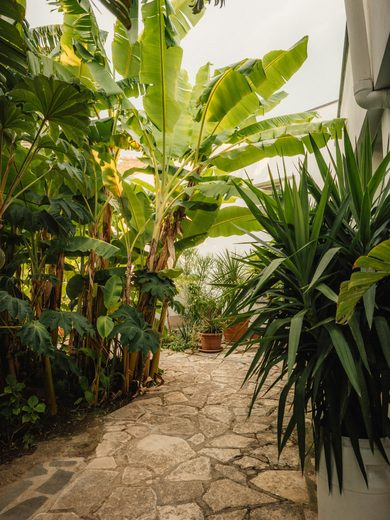
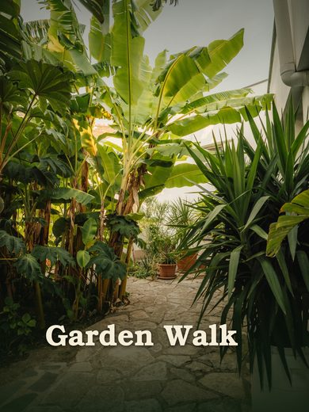
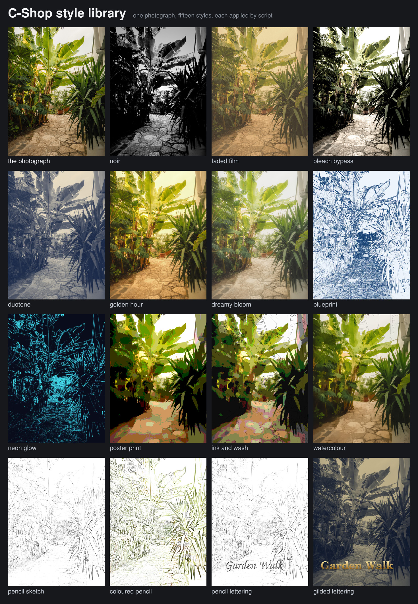
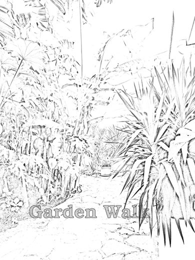
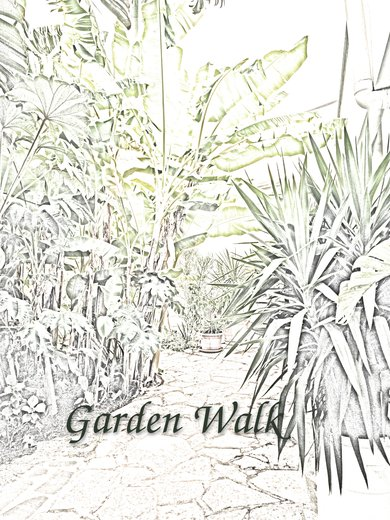

# Driving C-Shop without a window

A command language for callers that cannot see and cannot click — an agent, a
batch job, a test. Intake, draw, analyse, return.

```sh
cshop --script build.txt          # run a file
cshop --run "new 400 300 ..."     # run commands inline
cshop --script build.txt --json   # machine-readable report
```

Exit status is `0` when every step succeeded and `2` when any failed, so a
caller can branch on it without parsing anything.

It drives the same application the buttons do. There is no second API to drift
out of step: anything the editor gains is reachable here the same day.

## The loop it is built for

A script goes in, the document is built, and a **report** comes out saying what
actually happened — where every layer landed, what each step did, and what
failed and why — alongside the rendered image. A caller that cannot see the
canvas can still tell whether the text fitted or the shadow fell off the edge.

```
$ cshop --run 'new 400 240 background=#20304a
text 40 154 "Hello, agent" size=54 color=#ffffff bold
effect drop-shadow distance=6 size=8
export out.png'

Untitled: 400x240, 2 layers
  [0] Background               Raster  at (0, 0) 400x240
  [1] Hello, agent             Type    at (1, 71) 397x132  fx: Drop Shadow
5 steps ran, 0 failed
```

Two rules follow from the design:

- **Nothing fails silently.** An unknown command, an unparseable value, an
  action that could not apply — each becomes a failed step with a reason, and
  the run carries on so one typo does not discard the rest.
- **Measurements are free.** `measure` reports the size of type without drawing
  it, so a caller can place something before committing rather than rendering
  and guessing.

Placing text centred, without seeing it:

```
measure text "Hello, agent" size=54 bold
  → measure "Hello, agent": 319x54 (offset 0, -44)
```

319 wide on a 400 canvas puts the left edge at `(400-319)/2 = 40`; the offset
says the baseline sits 44 below the ink's top, so a baseline of `154` puts the
text's top at 110.

## Syntax

One command per line. `#` starts a comment. Arguments are positional, options
are `key=value`, and strings are double-quoted with `\n`, `\t` and `\"`
escapes. A bare word like `bold` means `bold=true` — nothing tells the parser
it is not a positional argument, so **bare flags go last**.

Colours are `#rgb`, `#rrggbb`, `#rrggbbaa`, or one of `black white red green
blue yellow orange purple grey transparent`. Paths may start with `~`.

## Commands

| Command | What it does |
|---|---|
| `new W H [background=]` | Start a document. Background is `white`, `transparent` or a colour. |
| `open PATH` | Open an image, a `.psd` or a `.cshop` project, with its layers. |
| `resize W [H]` | Resample. `fit=` scales the longest side and keeps the proportions, `scale=` multiplies, one dimension alone derives the other. `filter=` is `nearest bilinear bicubic lanczos`; `canvas` pads or crops instead of scaling. |
| `place [PATH]` | Bring an image in as a layer above the active one, `x=` `y=`. With no path it re-places the file the document was opened from. |
| `text X Y "..."` | A type layer, its baseline starting at X Y. `size= color= family= bold italic align= leading= tracking= wrap=` |
| `measure text "..."` | Report the size the same options would draw, without drawing it. |
| `shape KIND X Y W H` | `rect ellipse polygon star line`. `fill= stroke= stroke-width= stroke-align= radius= sides= inner= thickness=` |
| `path "M x y L x y ..."` | A Bézier path as its own layer. `M` starts a contour, `L` a straight segment, `C x1 y1 x2 y2 x y` a cubic, `Z` closes it. A path that never closes is stroked rather than filled. `fill= stroke= stroke-width=` |
| `combine OP` | Fold shape layers into one path: `union subtract intersect exclude`. `layers=0,2` picks them by the index `info` reports; without it, every shape in the document. |
| `detect [class= conf=]` | Find objects, and report each into the run's facts. Needs the [vision pack](VISION.md). |
| `segment [class=\|box=\|point=] [expand= feather=]` | Cut something out and leave it as the selection. With nothing said, uses what `detect` last found. |
| `fill COLOUR` | Fill the layer, or the selection if there is one. |
| `style NAME [key=value...]` | Apply a named style — see below. |
| `gradient X1 Y1 X2 Y2` | A gradient across the layer. Colours carry alpha, so `from=#00000000 to=#000000cc` is a wash that fades out. `style= blend= opacity= reverse` |
| `select X Y W H` \| `select all` \| `select none` \| `select invert` \| `select clear` | `feather=` softens the edge. |
| `effect NAME` | See below. Applies to the active layer; repeat to stack. |
| `filter NAME` | `gaussian-blur box-blur motion-blur surface-blur sharpen unsharp-mask add-noise high-pass find-edges median mosaic crystallize emboss solarize diffuse twirl` |
| `adjust NAME` | `brightness-contrast levels gradient-map photo-filter hue-saturation vibrance exposure invert posterize threshold black-and-white`, plus `as-layer` to keep it editable. |
| `layer WHAT` | `new group duplicate via-copy delete merge-down flatten rasterize select <index>`. `via-copy` lifts only what is selected onto a new layer. |
| `set key=value` | `opacity= fill-opacity= name= blend=` on the active layer. |
| `move DX DY` | Nudge the active layer. |
| `order WHERE` | `top bottom up down` |
| `info` | Report the document's size and layer count. |
| `export PATH` | Write it. The extension decides: `.cshop` and `.psd` keep layers, everything else is flattened. |

### Finding and cutting out an object

Two models, installed separately — see [VISION.md](VISION.md). One says what is
in a picture and where; the other turns a point or a box into a mask. Together
they take a photograph to a cut-out without the caller knowing anything about
the picture in advance:

```
open dog.jpg
resize fit=1000               # the models see plenty at this size, and it is quicker
detect                        # → dog 90% at 4,303 632x501; bench 56%
segment class=dog feather=1   # the dog becomes the selection
layer via-copy                # lift it onto its own layer
layer select 0
layer delete                  # drop the background
export dog.png                # PNG keeps the transparency
```

| | | |
|---|---|---|
|  |  |  |
| the photograph | what `detect` found | what `segment` cut out |

The middle picture was drawn by this same harness: the boxes and labels are
`shape` and `text` commands fed from the detector's own answer.

#### What a caller gets back

`detect` puts one fact per object into the report, so a caller reading the JSON
does not have to parse prose:

```json
"facts": {
  "detect dog":   "dog 90% at 4,303 632x501",
  "detect bench": "bench 56% at 0,511 667x472"
}
```

The box is `x,y` of its top-left then `width x height`, in document pixels
after any `resize` — the same coordinates `shape`, `text` and `select` take, so
a detection can be fed straight into them without conversion. Finding nothing
is not a failure: the fact reads `nothing the detector knows` and the run
carries on.

`segment` reports what it did in its step note — the class, the share of the
image covered, the bounds of the result and the model's own confidence — and
leaves the mask as the **selection**. That is the important part of the design:
there is no new noun to learn, because everything the editor already does with
a selection applies to it.

#### Prompting it

| | |
|---|---|
| `segment class=dog` | Detect that class and cut out the best match. |
| `segment` | Cut out whatever `detect` last found. |
| `segment box=x0,y0,x1,y1` | Cut out what is in that rectangle. |
| `segment point=x,y` | Cut out what is at that point; several as `x,y;x,y`. |
| `segment point=… not-point=x,y` | And exclude what is at these. |
| `expand=3` | Grow the result outward, up to 50 pixels. For an edge that has cut inside the subject, or to leave room for a stroke. |
| `feather=2` | Soften the edge of the result, in pixels. Applied after `expand=`. |
| `conf=0.4` | Raise the detector's threshold; 0.25 by default. |

#### Writing a script that cannot see

Three things are worth knowing before pointing an agent at this.

**The detector knows eighty kinds of thing and no others.** A sky, a mountain,
a road, a building, a plant: none of them are on the list, and `detect` on a
landscape comes back empty. That is not a failure to handle by retrying with a
lower threshold — it is the wrong tool for that subject. The segmenter has no
list at all, so `segment point=x,y` works on anything; but a point has to be
chosen, and choosing one without seeing the picture is guesswork. Prefer
`class=` where a class exists, and expect to look at the result where it does
not.

**Check the coverage before trusting it.** The step note says what share of the
image the mask took. A subject that should be a fifth of the frame coming back
at 95% means the model read the prompt as "everything", and a result of 0%
means it found no boundary there. Both are worth reacting to rather than
exporting.

**Refine with points rather than re-running.** Asked about a box, the model
answers "the object in this box" — a dog on a bench, boxed together, can come
back as one thing. A second call with `not-point=` on the part you do not want
costs nothing extra, because the expensive half of the work is cached against
the image.

A shape that survives all three:

```
open photo.jpg
resize fit=1600          # smaller is faster, and the models see plenty
detect class=person
segment feather=1
layer via-copy
layer select 0
layer delete
export person.png
```

`resize` first is worth doing: the models work at about a thousand pixels
whatever they are given, so a print-size photograph costs time in the reading
and buys nothing in the answer.

### Paths and boolean operations

```
path "M 20 180 C 60 20 140 20 180 180 Z" fill=#3366cc stroke=#122244 stroke-width=3

shape ellipse 10 30 100 100 fill=#3366cc
shape ellipse 70 30 100 100 fill=#3366cc
combine subtract
```

Combining keeps the operands inside the result rather than flattening them to
a single outline, so the operation stays editable: the shapes are evaluated
together each time the layer is drawn. Ordering is bottom-up, the way the
layers are stacked — the lowest is the shape being cut into.

A rectangle or an ellipse can take part in a combination as readily as a path;
its outline is converted to contours first, which is checked by rendering the
two against each other.

### The three tonal adjustments

Most photographic looks are made of these rather than of brightness and
contrast, so they are worth their own note.

| Adjustment | Options | What it is for |
|---|---|---|
| `levels` | `black= white= gamma= out-black= out-white=` | Where the ends of the tonal range sit. `out-black=0.16` means no pixel may be darker than that, which is how faded stock is made — no reduction in contrast alone reproduces it. |
| `gradient-map` | `from= to= mid= midpoint=` | Replaces colour with a ramp indexed by brightness. Two inks, a blueprint, a sun-print. |
| `photo-filter` | `color= density= preserve-luminosity=` | A cast over everything, without the tonal shift a coloured overlay brings. |

### Effects

`drop-shadow inner-shadow outer-glow inner-glow bevel emboss satin
color-overlay gradient-overlay pattern-overlay stroke`, and `none` to clear
them.

Common options: `color= opacity= size= blend=`. Then by effect:
`distance= angle= spread=` or `choke=` for shadows and glows; `position=` for
stroke (`inside centre outside`); `from= to= style= scale= reverse` for the
gradient; `pattern= background= scale= angle=` for the pattern; `style= depth=
soften= altitude=` for the bevel.

## Worked example: an agent doing a real job

The point of the report and of `measure` is that they let a caller work
*without seeing the picture*. Here is what that looks like in practice. The
instruction was:

> pick `~/assets/gardenpath.jpg` and apply some decorative gradient shading,
> add a text that says Garden Walk and save as `garden-processed.jpg` in the
> same directory

| Before | After |
|---|---|
|  |  |

### Look before deciding

The source is 3052x4060: bright sky and dense foliage across the upper two
thirds, a stone path along the bottom. That matters, because the path is the
only calm region — everything above it is too busy for type to survive on.
Which is what decides where the text goes and, in turn, what the shading is
for.

### Ask for the numbers rather than guessing

```
open ~/assets/gardenpath.jpg
info
measure text "Garden Walk" family="URW Bookman" size=290
```

```
gardenpath.jpg: 3052x4060, 1 layers
  document: 3052x4060, 1 layers
  measure "Garden Walk": 1909x348 (offset 0, -210)
```

That is the whole trick. 1909 wide on a 3052 canvas centres at
`(3052 − 1909) / 2 = 571`. The offset says the baseline sits 210 below the
ink's top, so a baseline of 3520 puts the type's top at 3310 — low on the
path, with room beneath it. No rendering, no guessing, no iterating toward a
number that was knowable up front.

### The script

```
open ~/assets/gardenpath.jpg

# A deep green-black wash rising from the bottom. It grounds the composition
# and gives the title something to sit on, instead of letting it fight the
# stone texture. Green-black rather than neutral, to stay in the picture's
# own palette.
layer new
set name="Shade — bottom"
gradient 0 4060 0 2450 from=#0a1a0cd8 to=#0a1a0c00

# A far subtler one from the top, so the bright sky does not run away with
# the eye and the frame feels closed.
layer new
set name="Shade — top"
gradient 0 0 0 1150 from=#08140a70 to=#08140a00

text 571 3520 "Garden Walk" family="URW Bookman" size=290 color=#f5ecd8
effect drop-shadow distance=16 size=38 opacity=0.55 angle=115

export ~/assets/garden-processed.jpg
```

Every size is scaled for a 4060-pixel-tall image. A shadow of `size=8` — a
sensible number on a screenshot — would be invisible here.

### Read the report back

```
gardenpath.jpg: 3052x4060, 4 layers
  [0] Background               Raster  at (0, 0) 3052x4060
  [1] Shade — bottom           Raster  at (0, 0) 3052x4060
  [2] Shade — top              Raster  at (0, 0) 3052x4060
  [3] Garden Walk              Type    at (397, 3136) 2257x696  fx: Drop Shadow
10 steps ran, 0 failed
```

The type layer reports 2257x696 at (397, 3136) — larger than the 1909x348 that
was measured, because the drop shadow reaches beyond the letters. Both numbers
are useful and they are not the same number: `measure` gives the ink, the
report gives everything the layer draws. A caller checking whether a title
fits inside the frame wants the second.

### Then look at it

The last step is one no report can do. Render, open the image, and check the
things a summary cannot describe: at 1:1, not downscaled, because a preview
hides exactly what goes wrong — antialiasing on the serifs, and banding across
a smooth wash. Both were clean here; if the gradient had banded, the fix would
have been the `dither` option that is on by default for precisely that reason.

### What the job exposed

Putting the pathway to real work immediately found two gaps that building it
had not: there was no `gradient` command at all, so decorative shading could
only have been faked with a shape at zero fill opacity; and a leading `~` was
treated as a folder of that name, so the very first line failed with a
complaint about a directory nobody had asked for. Both are fixed. That is the
argument for using a tool on something real before believing it is finished.

## Styles

A style is a named script fragment with holes in it. Not a new kind of thing:
the same commands, parameterised — so there is one language to learn, a style
can be read by anyone who can read a script, and a style can use anything the
editor can do the day it can do it.

```
# styles/pencil-sketch.style
param blur = 12
param contrast = 0.32

adjust black-and-white
layer duplicate
adjust invert
filter gaussian-blur radius={blur}
set blend="Color Dodge"
layer flatten
adjust brightness-contrast contrast={contrast}
```

```
open photo.jpg
style pencil-sketch blur=60
export sketch.png
```

Styles are looked for beside the script, in a `styles/` directory next to it or
next to the binary, and in `~/.config/cshop/styles`. A name that is really a
path works too, for a one-off.

Everything is checked rather than assumed. A parameter the style does not
declare is refused with the list of the ones it takes; an unknown `{hole}` is
an error rather than being left in the text, because a script that drew
`{blur}` pixels of blur would be worse than one that stopped; an unknown style
names the styles that do exist; and because a style is script and script can
apply a style, one that applies itself is stopped rather than running away.
Steps a style runs are prefixed with its name — `pencil-sketch: adjust invert`
— and nested styles show the whole trail, so a failure inside one is traceable
to the line of the file it came from.

Styles compose. The worked example below applies one to a photograph and
another to the type on top of it.

### Holes, and the arithmetic in them

A hole that is a bare name is replaced verbatim, so a parameter can carry a
word — `set blend="{mode}"` works. Anything else is read as arithmetic over the
parameters: `+ - * /`, parentheses, and nothing else. It is there so a style
can scale itself, not so that styles can become a programming language.

Six names are bound for that purpose whenever a document is open — `width`,
`height`, `min`, `max`, `cx`, `cy` — under the style's own parameters, so a
style that wants to declare its own `width` still can.

```
filter surface-blur radius={min*0.0325} threshold={flatten}
gradient {cx} {cy} {cx} {cy - max*size} style=radial from=#00000000 to=#000000
```

This is what lets a style be written once and applied to a thumbnail and to a
print. It matters more than it sounds: a blur radius is a *fraction of the
picture*, and a style whose radii are literal pixel counts silently means
something different on every image it is given.

Not everything should scale, though, and the styles that ship disagree with
each other on purpose. Grain is a property of the emulsion rather than of the
enlargement, so `film-grain` is in pixels. So is the cross hatching in
`pencil-lettering`, which stands for the width of a pencil — a hatch of 14 that
suits 290-pixel type also suits 170-pixel type, where scaling it proportionally
to 8 makes it vanish. Ask what the number *is* before deciding.

### The style library

Seventeen styles ship in [`styles/`](../styles), each with its reasoning
written down in the file. Fifteen of them applied to one photograph — the two
composable ones appear only inside the others:



**Tonal.** `noir` crushes to high-contrast monochrome and pulls the corners
down. `faded-film` lifts the blacks so the deepest shadow is a soft grey.
`bleach-bypass` keeps colour weakly under a much harder curve. `duotone` maps
the picture onto a ramp between two inks. `golden-hour` warms it and blooms the
highlights. `dreamy-bloom` does the same with a wider radius and no warmth, so
it reads as diffusion rather than sunlight.

**Illustrative.** `blueprint` turns edges into chalk lines on blue.
`poster-print` reduces to flat screenprinted colour. `ink-and-wash` puts pen
work over a posterised wash. `watercolour` flattens into washes and pools
pigment at the edges. `neon-glow` lights the edges on a dark ground.
`pencil-sketch` and `coloured-pencil` are described below.

**Type.** `pencil-lettering` makes type look drawn; `gilded-lettering` stamps
it in gold leaf.

**Composable.** `vignette` and `film-grain` are finishing styles, meant to be
called by others — `noir` and `faded-film` both do.

That contact sheet is itself a script: fifteen `open` / `resize` / `style` /
`export` runs to make the renders, then a `new`, sixteen `place` calls and
sixteen `text` calls to lay them out. Nothing outside the editor assembled it,
which is the point — a caller that can drive the harness can also produce the
evidence of what it did.

### The pencil styles, in detail

`pencil-sketch` turns a photograph into bright graphite on white paper,
`coloured-pencil` lays its own colour back over that, and `pencil-lettering`
makes type look drawn rather than typeset. They compose, and the appendix at
the end of this document walks through how the second was arrived at.

| | |
|---|---|
|  |  |
| `pencil-sketch` + `pencil-lettering` | `coloured-pencil`, lettered in a script face |

The sketch is the old darkroom trick done in layers: desaturate, take a copy,
invert it, blur it, and colour-dodge it back over the original. Dodge divides
by the inverse of the blend, so wherever the blurred copy matches its
surroundings the result saturates to white paper — and only where it does
*not*, which is where an edge is, does anything stay dark. `blur` is the
pencil: small is a hard line, large a soft shaded stroke. `contrast` lifts the
paper to white and pushes the strokes toward black, which is what "bright" is
made of.

`coloured-pencil` then lays the photograph back over its own drawing with
**Color** blending, which takes hue and saturation from the top layer and
lightness from what is underneath — so the paper stays paper and the strokes
pick up the subject's own greens. It calls `pencil-sketch` with a *lower*
contrast than the graphite look uses, and that is the part worth knowing:
colour blending keeps the backdrop's lightness, so a sketch pushed all the way
to white paper leaves colour nowhere to live. There is no such thing as a
saturated green at 98% lightness. Turning the contrast up makes the drawing
brighter and the colour weaker at the same time.

The other order — the sketch on top in **Luminosity** — is the same result at
full opacity, because the two modes are duals. They differ only in what partial
opacity mixes toward: Color fades toward the grey drawing, Luminosity toward
the untouched photograph.

Three things that cost a round of rework and are worth knowing:

**Pixel figures are relative to the image, not the picture.** `blur=12` was
tuned on a fifth-scale copy; the full-size render needed `blur=60` to look the
same. That is what the arithmetic above was added for, and `coloured-pencil`
now asks for a `softness` fraction instead — 0.0148 of the long side, which is
the same 60 pixels at the size it was tuned on and the right number everywhere
else.

**Judge at 1:1, never on a preview.** The lettering's cross hatching looked
like graphite when shrunk and like a mechanical plaid at full size — the
downscale had been averaging it away. The fix was a hatch a third as coarse.
Checking the preview alone would have shipped the plaid.

**A brighter drawing takes colour worse.** Which is why `coloured-pencil` asks
for a softer sketch than the graphite look, and why turning its `contrast` up
makes the picture brighter and the colour weaker at the same time.

The appendix at the end of this document walks through how that style was
arrived at, attempts and dead ends included, as a worked example of pursuing a
picture through this harness rather than a command.

## Appendix: pursuing an objective through the harness

The rest of this document says what the commands do. This says what *using*
them looks like when the goal is a picture rather than a command — the whole
sequence for one style, including the attempts that were abandoned and why,
because the abandoned ones carry most of the information.

The brief was: take the pencil sketch, lay the original back over it with
colour blending at 50% to recolour it, make it look like a coloured pencil
drawing; try either the colour on top or the sketch on top with lightness
blending; and letter it in a different face with a drop shadow.

### 1. Start from a known recipe, then check it exists

A pencil sketch from a photograph is a solved problem: desaturate, take a copy,
invert it, blur it, and colour-dodge it back over the original. Nothing had to
be invented — the first question was only whether the parts were reachable.
They were: `adjust black-and-white`, `layer duplicate`, `adjust invert`,
`filter gaussian-blur`, `set blend="Color Dodge"`. The one thing worth checking
before writing anything was the blend mode's exact name, because a script that
misspells it fails on the line that matters.

The first run produced a real sketch. That is the useful thing about starting
from a recipe: the first attempt is a starting point rather than a guess.

### 2. Vary one thing at a time, and look at them together

The first sketch was faint. Rather than nudging one number and re-rendering,
four variants went out at once — blur 3, 6 and 12, contrast 0 to 0.55 — tiled
into one sheet. One look ranks four candidates; four looks rank them badly,
because by the fourth you are comparing an image against a memory.

Blur 12 had the most graphite character. Higher contrast drifted toward line
art: crisper, but the tonal shading that makes a drawing look drawn was gone.

### 3. Judge at the size it will be seen

The lettering went through the same treatment — outline only, outline plus a
wash, solid grey, then cross hatching — and hatching plus wash plus outline won
on the small test.

At full size it was a **mechanical plaid**. The hatch that read as graphite on
a fifth-scale preview was, at 1:1, an obvious geometric grid. The downscale had
been averaging it away and flattering it.

This is the single most expensive mistake available here. Every intermediate
check is on a small copy because that is what makes iteration fast, and the
thing that breaks is precisely the thing a small copy hides: texture,
antialiasing, banding. The hatch went from 35 to 14 and the outline from 8 to
5, and both were then checked at 1:1 before anything else was believed.

The same trap caught the pixel figures. `blur=12` was tuned on a fifth-scale
copy; the full-size render needed `blur=60`. Nothing in the language multiplies
for you, and a blur is in pixels, so it is relative to the image and not to the
picture.

### 4. When the brief will not work, find out why before trying alternatives

The instruction was Color blending at 50%. It produced almost nothing. So did
75%. So did **100%** — which is the observation that mattered, because it ruled
out opacity as the problem and pointed at the blend itself.

Color blending takes hue and saturation from the top layer and **lightness from
the backdrop**. The backdrop was a sketch pushed to near-white paper. There is
no such thing as a saturated green at 98% lightness, so the colour had nowhere
to live. The instruction was not wrong; it was being applied to a drawing with
no tonal room in it.

That diagnosis is what made the next step obvious rather than a guess. Several
alternatives were on the table at that point, and knowing *why* it failed is
what let three of them be discarded without being tried:

**The other ordering — sketch on top, Luminosity.** Tried, and it worked at
50%: real colour, real structure. But it turned out to be the same result as
Color at full opacity, because the two modes are duals. They differ only in
what partial opacity fades *toward* — Color toward the grey drawing, Luminosity
toward the untouched photograph. Which meant the choice was not "which mode"
but "which end do I want to fade toward", and for a drawing the answer is the
drawing. At 65% it looked like a stylised photograph rather than a drawing:
solid grey-green blocks where the leaves should have had strokes.

**Saturating the colour layer before blending.** Tried, and it did rescue the
brightness problem: white paper with visibly coloured strokes. But it is a
different picture — coloured *line art*, not a coloured drawing, because the
lightness still came from a sketch with no midtones. Kept as a discovery, not
used.

**Multiply.** Discarded by reasoning rather than trial. Multiply darkens, so
white paper times colour is fully coloured paper — the exact inverse of what
coloured pencil does, which is leave unworked paper white. Not worth a render.

**The fix was in none of them.** It was the layer underneath: turn the sketch's
contrast down from 0.32 to 0.10 so it keeps some midtone, and the original
instruction works exactly as written. Colour blending at 50% over a softer
drawing gives white paper with coloured strokes.

The general shape of that: when an instruction does not work, the thing to
change is often not the thing the instruction names.

### 5. Honour the brief, and report what you found

Rendered at 50, 75 and 100 percent over the softened sketch, all three read as
coloured pencil. 75% is the strongest. The delivered image uses **50%**,
because that is what was asked for and it works now — with the finding reported
rather than the number quietly changed. A caller who wants it stronger changes
one word, and knows to.

### 6. Let the goal reshape the tool, but only where it must

Two gaps turned up, and they were handled differently.

Applying the original back over the sketch was impossible: the style ends by
flattening, so there was nothing left to blend with. Three options —
restructure `pencil-sketch` not to flatten, `open` the original again, or add a
way to bring an image in as a layer. The first was rejected because flattening
is exactly what makes the style composable with everything after it; the second
because `open` replaces the document rather than adding to it. So `place` was
added, which was a missing capability rather than a workaround.

Then making the result a *style* needed the original's path, which a style has
no way to know. Rather than adding a required parameter that every caller would
have to repeat, `place` with no argument re-places the file the document was
opened from. Small, and it makes the style self-contained.

### 7. Not every earlier decision survives

The graphite lettering style — outline, hatching, wash — was dropped for this
picture. The new face is a calligraphic script with thin strokes, and hatching
inside a thin stroke is noise. A drop shadow was asked for and suits it better.
Reusing the earlier answer because it was the earlier answer would have made a
worse picture.

### What it added up to

Roughly a dozen renders, four of them tiled comparisons; two capabilities added
to the harness; three approaches rejected, two after trying them and one on the
reasoning alone; and one assumption in the brief that had to be diagnosed
before it could be honoured. The finished style is nine lines. Most of the work
was deciding what those nine lines should say, and the record of *why* they say
it is in the style file itself, where the next person to read it will need it.

## Over a network

The same harness serves over the Model Context Protocol, so the caller need not
be on this machine — and a tool result can carry a picture, which is what lets
the loop above close remotely rather than only in a terminal.

```sh
cshop --serve --workspace ~/pictures
```

Because a script can read and write files, a served editor is confined to one
workspace, bound to loopback unless a token is set, and checked for browser
origins. [SERVING.md](SERVING.md) covers the tools, sessions and the guards.

## What it does not do

No loops, variables or arithmetic — a caller that needs those has a real
language and can emit the script. Curves and levels take no parameters here
yet, and there is no way to paint a brush stroke: the pathway is aimed at
composition, type and effects rather than freehand work.
